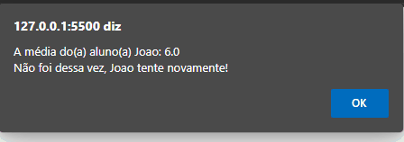

<h1 align="center">JS - DESAFIO  - FUNÇÃO E OPERADORES CONDICIONAIS </h1>

 
 

  

 
    <a href="https://fernandoaugustodev.github.io/Funcao_Operadores_Condicionais/" target="_blank" >Veja o Projeto</a>

## 💻 Sobre o Projeto
 

 Desafio é treinar tudo o que foi aprendido no stage 4 do curso 

- Estrutura de dados com objetos;
- Estrutura de repetição;
- Criação de funções;
- Operadores comparativos;

 

## 🛠 Techs

Tecnologias usadas neste projeto

✅ HTML  
✅ JS   
---

## 👨🏼‍💻 Autor

Fernando Augusto 

 
  
 
© 2022 GitHub, Inc.
Terms Privacy Security Status Docs
